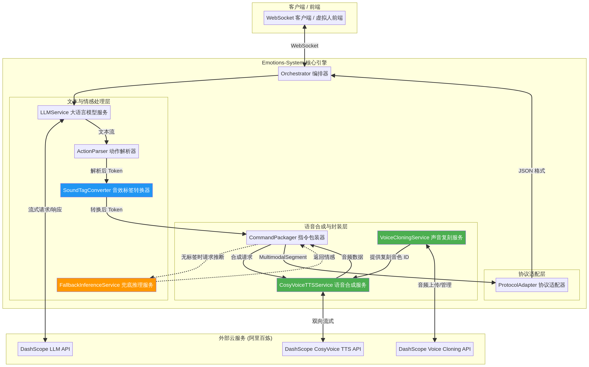

# Emotions-System — Architecture Design

## High-Level Architecture

Emotions-System 采用基于 Python 的异步流式处理架构，核心引擎通过 WebSocket 与前端进行通信。系统分为四个主要逻辑层：文本与情感处理层、语音合成与封装层、协议适配层以及外部云服务层。

## Module Responsibilities

| Module | Primary Responsibility | Technology | Dependencies |
|--------|----------------------|------------|--------------|
| **Orchestrator** | 管理 WebSocket 连接，协调各个模块的工作流，处理并发请求。 | FastAPI, asyncio | 所有内部模块 |
| **LLMService** | 与大语言模型通信，生成带有情感指令和动作标签的流式文本。 | OpenAI SDK | DashScope LLM API / OpenAI API |
| **ActionParser** | 从 LLM 的流式输出中实时解析出文本、情感标签、动作指令。 | Python (Regex) | 无 |
| **SoundTagConverter** | 拦截音效标签，将支持的音效转换为 TTS 引擎可识别的文本内标记（如 `[laughter]`）。 | Python | ActionParser |
| **CommandPackager** | 按句子边界切分文本，调用 TTS 服务合成语音，并将音频、文本、动作组装为多模态片段。 | Python, asyncio | SoundTagConverter, TTSService |
| **FallbackInferenceService** | 在 LLM 未输出情感标签时，根据文本内容自动推断情感。 | Python | CommandPackager |
| **CosyVoiceTTSService** | 将文本和情感指令转换为音频流，支持双向流式通信。 | DashScope SDK | DashScope CosyVoice TTS API |
| **VoiceCloningService** | 管理用户上传的参考音频，调用 API 进行零样本音色复刻，并提供音色 ID。 | DashScope SDK | DashScope Voice Cloning API |
| **ProtocolAdapter** | 将系统内部的多模态片段对象序列化为前端兼容的 JSON 格式（如 Open-LLM-VTuber 协议）。 | Python (Pydantic) | CommandPackager |

## Data Flow Scenarios

### Scenario 1: Write Operation — 声音复刻与配置

1. **Entry point**: 用户通过系统提供的管理脚本或 API 上传一段包含其声音的 WAV 音频文件（3-10秒）。
2. **Processing**: `VoiceCloningService` 接收音频文件，验证格式和大小是否符合要求。
3. **Storage/External API**: 服务调用阿里百炼 DashScope 的 Voice Cloning API，上传音频并请求创建一个新的复刻音色。
4. **Response**: 阿里百炼返回一个唯一的 `voice_id`。系统将该 ID 与用户配置关联并持久化（可存入本地配置文件或数据库），供后续的 TTS 合成使用。

### Scenario 2: Read Operation — 流式对话与情感语音合成

1. **Entry point**: 前端通过 WebSocket 发送用户的语音转录文本或直接发送文本消息。
2. **LLM Generation**: `Orchestrator` 将消息传递给 `LLMService`。LLM 开始流式返回带有复合标签的文本（例如：`[emotion:happy|instruction:带着笑意] 今天天气真好 [sound:laugh] 我们出去玩吧！`）。
3. **Parsing & Conversion**: 
   - `ActionParser` 实时解析出文本和标签。
   - `SoundTagConverter` 拦截到 `[sound:laugh]`，将其转换为文本标记 `[laughter]` 附加在后续文本中。
4. **TTS Synthesis**: 
   - `CommandPackager` 收集到一个完整的句子后，提取 `emotion` 和 `instruction`。
   - 调用 `CosyVoiceTTSService`，采用双向流式模式，传入复刻的 `voice_id`、文本和 `instruction`。
5. **Response**: 
   - TTS 增量返回音频流（WAV 格式）。
   - `ProtocolAdapter` 将音频片段（Base64编码）、文本和基础 `emotion` 打包为 JSON，通过 WebSocket 实时发送给前端进行播放和动画渲染。

## Design Decisions

### Decision 1: 音效标签的内生化处理

- **Context**: 原有系统将音效作为独立动作发送给前端，导致播放时产生断层感，且音色与 TTS 语音不一致。
- **Options Considered**: 
  1. 维持原样，由前端混音。
  2. 在后端将音效文件与 TTS 音频进行音频拼接（Audio Concatenation）。
  3. 利用 CosyVoice 的内置标记能力。
- **Decision**: 选择选项 3，新增 `SoundTagConverter` 模块。
- **Rationale**: 选项 3 实现最简单且效果最好。CosyVoice 在生成 `[laughter]` 时会自动匹配当前说话人的音色，实现真正的无缝融合。对于不支持的音效，退回使用 SSML 标签。

### Decision 2: 情感粒度的混合模型

- **Context**: 前端虚拟人通常只需要 5-7 种基础情感来切换面部表情（如切换到“笑脸”材质），但语音合成需要更细腻的自然语言指令。
- **Options Considered**: 
  1. 完全放弃枚举，只使用自然语言指令。
  2. 保持原有枚举，在 TTS 内部进行固定映射。
  3. 采用 `[emotion:基础枚举|instruction:自然语言指令]` 的复合标签格式。
- **Decision**: 选择选项 3 的复合标签格式。
- **Rationale**: 这种设计既满足了前端对离散状态（枚举）的强依赖，又释放了 CosyVoice 对连续、细腻情感（指令）的控制能力。动作解析器负责将两者分离并分别路由。

### Decision 3: 双向流式 TTS 架构

- **Context**: 传统的 TTS 调用需要等待整句话合成完毕才能返回音频，导致交互延迟过高（通常 > 2秒）。
- **Options Considered**: 
  1. 阻塞式单次调用。
  2. 阿里百炼的双向流式调用（WebSocket）。
- **Decision**: 采用双向流式调用。
- **Rationale**: 结合 LLM 的流式输出，双向流式 TTS 可以实现边生成文本、边合成语音、边传输给前端播放，极大降低首字响应时间（TTFB），提升交互的自然度。

## Scalability Considerations

- **异步 I/O**: 核心组件（LLM、TTS、WebSocket）全部采用 Python `asyncio` 异步实现，单节点可支持数十个并发会话而不会阻塞线程。
- **无状态设计**: `Orchestrator` 管理的会话状态保存在内存中，如果需要水平扩展，可以引入 Redis 来管理会话上下文，实现多节点部署。

## Security Considerations

- **API 密钥管理**: 所有外部服务（OpenAI、DashScope）的 API 密钥必须通过环境变量或安全的配置文件注入，严禁硬编码。
- **音频数据隐私**: `VoiceCloningService` 处理的用户参考音频可能包含生物特征信息。系统不应永久存储这些原始音频文件，上传至阿里百炼后应清理本地缓存。
