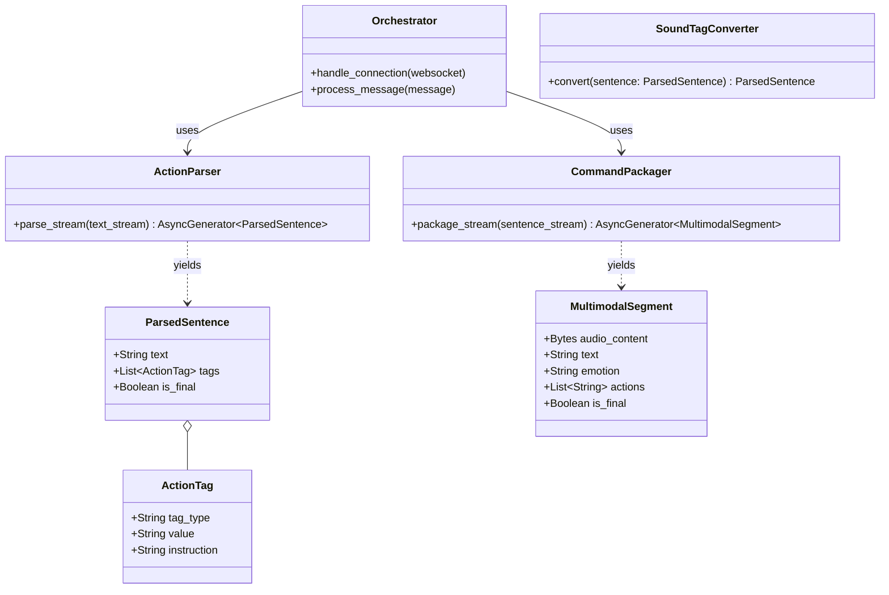

# Emotions-System — Interface & Data Structure Design

## 1. Data Models (Pydantic Models)

系统的核心数据结构用于在各个处理层之间传递信息，以及最终与前端进行序列化通信。

### 1.1 `ActionTag` (动作标签)
表示从文本中解析出的控制指令（如情感、音效、动作）。
```python
class ActionTag(BaseModel):
    tag_type: str        # e.g., "emotion", "sound", "action"
    value: str           # 基础枚举值，e.g., "happy", "laugh"
    instruction: str = "" # 附加的自然语言指令，e.g., "语气活泼俏皮" (可选)
```

### 1.2 `ParsedSentence` (解析后的句子)
表示 LLM 输出的单个完整句子，包含文本内容和关联的动作标签。
```python
class ParsedSentence(BaseModel):
    text: str
    tags: List[ActionTag] = Field(default_factory=list)
    is_final: bool = False # 是否是 LLM 响应的最后一句
```

### 1.3 `MultimodalSegment` (多模态片段)
系统最终输出给协议适配器的对象，包含要播放的音频和要执行的动作。
```python
class MultimodalSegment(BaseModel):
    audio_content: bytes       # 原始 WAV 音频数据
    text: str                  # 对应的文本
    emotion: str = "neutral"   # 基础情感枚举，用于前端表情驱动
    actions: List[str] = Field(default_factory=list) # 动作指令列表
    is_final: bool = False     # 是否是当前对话的最后一段
```

### 1.4 `VoiceCloneConfig` (声音复刻配置)
```python
class VoiceCloneConfig(BaseModel):
    voice_id: str              # 阿里百炼返回的复刻音色 ID
    name: str                  # 用户自定义的音色名称
    description: str = ""      # 音色描述
```

## 2. Core Interfaces (Abstract Base Classes)

### 2.1 `ILLMService`
处理与大语言模型的通信。
```python
class ILLMService(ABC):
    @abstractmethod
    async def generate_response_stream(self, prompt: str, history: List[dict]) -> AsyncGenerator[str, None]:
        """流式生成带有情感/动作标签的回复文本。"""
        pass
```

### 2.2 `ITTSService`
处理语音合成。
```python
class ITTSService(ABC):
    @abstractmethod
    async def synthesize_stream(self, text: str, emotion_instruction: str, voice_id: str) -> AsyncGenerator[bytes, None]:
        """
        双向流式合成语音。
        :param text: 要合成的文本（可能包含 [laughter] 等 CosyVoice 标记）
        :param emotion_instruction: 情感自然语言指令
        :param voice_id: 复刻音色 ID 或系统内置音色 ID
        """
        pass
```

### 2.3 `IVoiceCloningService`
处理声音复刻。
```python
class IVoiceCloningService(ABC):
    @abstractmethod
    async def clone_voice(self, audio_file_path: str, voice_name: str) -> VoiceCloneConfig:
        """上传音频并创建零样本复刻音色。"""
        pass
        
    @abstractmethod
    async def list_voices(self) -> List[VoiceCloneConfig]:
        """获取当前可用的复刻音色列表。"""
        pass
```

### 2.4 `IFallbackInferenceService`
在没有显式情感标签时推断情感。
```python
class IFallbackInferenceService(ABC):
    @abstractmethod
    async def infer_emotion(self, text: str) -> ActionTag:
        """根据文本内容推断最合适的情感枚举和指令。"""
        pass
```

### 2.5 `IProtocolAdapter`
适配前端协议。
```python
class IProtocolAdapter(ABC):
    @abstractmethod
    def adapt(self, segment: MultimodalSegment) -> dict:
        """将系统内部的片段对象转换为前端期望的 JSON 字典。"""
        pass
```

## 3. Data Flow & Class Diagram


```
